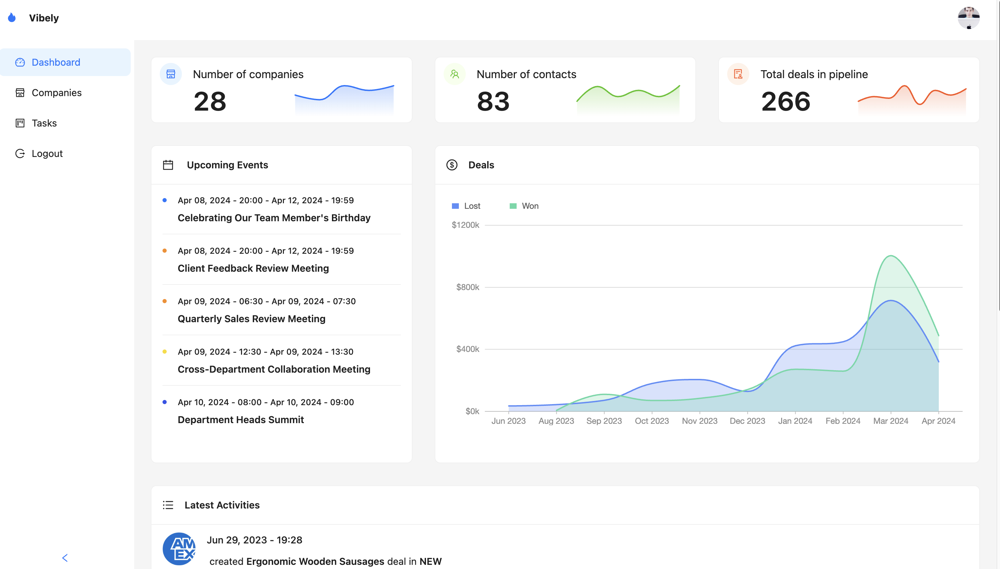

<div align="center" style="margin: 30px;">


</div>

<br />

<div align="center">
Welcome to Vibely - a streamlined, open-source CRM solution designed to enhance your business relationships, streamline processes, and improve profitability. This proof of concept project showcases an intuitive and minimalistic approach to customer relationship management.

<br />

</div>
<br />

⭐ **Checkout the live demo of the application [here](https://vibely-black.vercel.app/).**

## Tech Stack

- Refine
- TypeScript
- GraphQL
- Ant Design
- Codegen
- Vite

## Features

**Authentication**: Seamless onboarding with secure login and signup functionalities; robust password recovery ensures a smooth authentication experience.

**Authorization**: Granular access control regulates user actions, maintaining data security and user permissions.

**Home Page**: Dynamic home page showcases interactive charts for key metrics; real-time updates on activities, upcoming events, and a deals chart for business insights.

**Companies Page**: Complete CRUD for company management and sales processes; detailed profiles with add/edit functions, associated contacts/leads, pagination, and field-specific search.

**Kanban Board**: Collaborative board with real-time task updates; customization options include due dates, markdown descriptions, and multi-assignees, dynamically shifting tasks across dashboards.

**Account Settings**: Personalized user account settings for profile management; streamlined configuration options for a tailored application experience.

**Responsive**: Full responsiveness across devices for consistent user experience; fluid design adapts seamlessly to various screen sizes, ensuring accessibility.

<br>


## Try this example on your local

```bash
git clone https://github.com/zaid296imtiaz/Vibely.git
cd Vibely
```

Once it's done, go to the directory and run the following command to start the project:

```bash
npm run dev
```

Open http://localhost:5173 in your browser to view the project.

